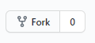
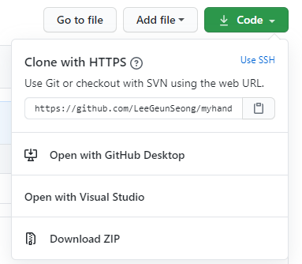
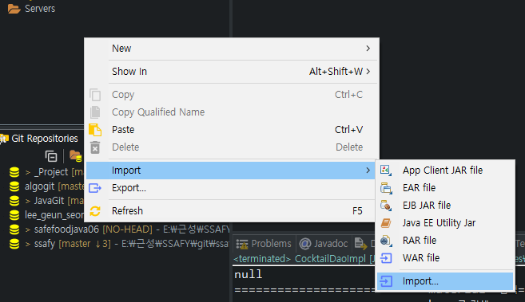
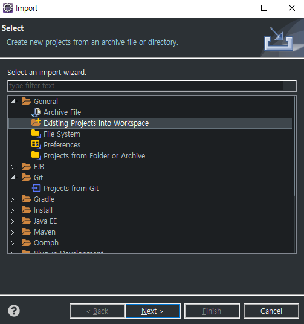
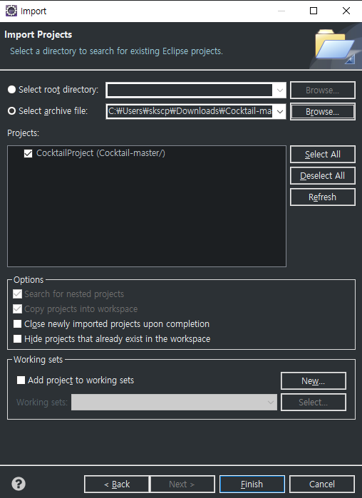

https://github.com/LeeGeunSeong/Cocktail

## 순서
----

1. eclipse 설치  
   https://www.eclipse.org/downloads/packages/release/photon/r  
   Eclipse IDE for Java EE Developers 설치
2. Encoding 설정
   1. Window -> Preference -> encoding 검색
      1. WorkSpace -> Text file encoding -> Other -> UTF-8
      2. Web -> CSS/HTML/JSP Files -> Encoding -> UTF-8

3. fork  
    
4. 개인 repo 들어가서 code -> download ZIP  
    
5. eclipse 들어가서 Project Explorer에서 우클릭 -> import -> import  
    
6. Existing Projects into Workspace -> next  
    
7. Select archive file -> Browse -> 다운받은 zip파일 선택하고 Projects에서 프로젝트 선택하고 finish  
    
8. 프로젝트 ㄱㄱ